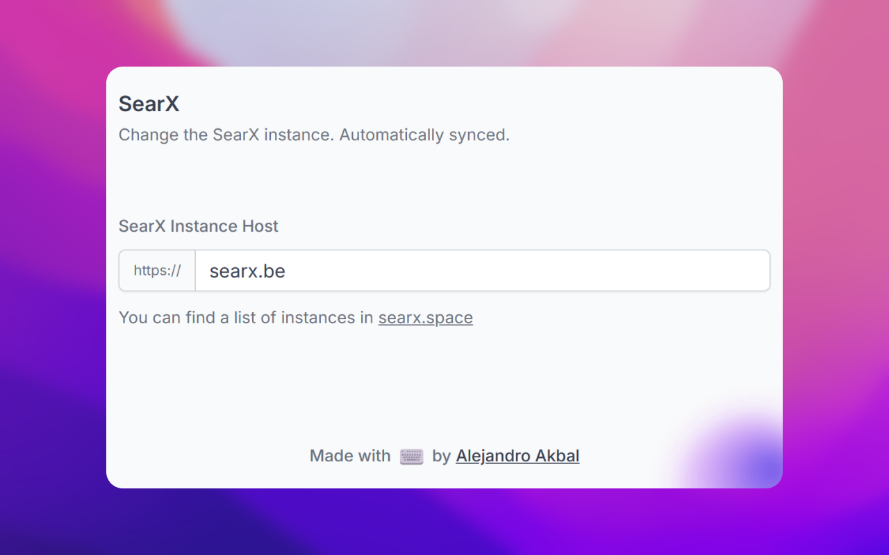

<p align='center'>
  
</p>

<h1 align='center'>
SearX Search Provider Extension
</h1>

**A configurable lightweight browser extension that sets SearX as your default search engine.**

## Highlights:

- **Privacy by Default**: SearX doesn't track your searches.
- **Install and Forget**: Simply install the extension and SearX becomes your default search engine.
- **Options**: Effortless switch between SearX instances, setting you free from the need to fork or create a new
  extension each time.
- **Synchronization**: Use your browser's sync to match your options across different devices.
- **SearXNG compatible**: Works seamlessly with **SearXNG** instances



## Get the extension

[](https://chrome.google.com/webstore/detail/hmbgmokpddhjjncclckdfnolbhfjnoam)

[//]: # ([![Firefox Add-ons]&#40;https://blog.mozilla.org/addons/files/2020/04/get-the-addon-fx-apr-2020.svg&#41;]&#40;https://addons.mozilla.org/en-US/firefox/addon/cache-disabler/&#41;)

## How it works

There are two main components to this extension:

- Browser extensions are not allowed to have dynamic search engines.
- Browser extensions are not allowed to redirect the default search engine.

This extension uses a workaround by always pointing search requests to a subdomain I own _searx.akbal.dev_.

This subdomain then redirects to a fake subdomain, which the extension CAN redirect from,
_searx-to-localhost.akbal.dev_.

That's the magic!
Don't worry about privacy, I don't log any requests, and the extension is open source.

### Known Issues

- Auto-complete does not work. Seems like declarativeNetRequest rules don't take over on autocomplete requests.
- There's no Firefox version yet. For some reason, redirects are not working. (Help wanted!)

## Getting Started

First, run the development server:

```bash
pnpm dev
# or
npm run dev
```

Open your browser and load the appropriate development build. For example, if you are developing for the chrome browser,
using manifest v3, use: `build/chrome-mv3-dev`.

You can start editing the popup by modifying `popup.vue`. It should auto-update as you make changes. To add an options
page, simply add a `options.tsx` file to the root of the project, with a react component default exported. Likewise to
add a content page, add a `content.ts` file to the root of the project, importing some module and do some logic, then
reload the extension on your browser.

For further guidance, [visit our Documentation](https://docs.plasmo.com/)

## Making production build

Run the following:

```bash
pnpm build
# or
npm run build
```

This should create a production bundle for your extension, ready to be zipped and published to the stores.

## Submit to the webstores

The easiest way to deploy your Plasmo extension is to use the built-in [bpp](https://bpp.browser.market) GitHub action.
Prior to using this action however, make sure to build your extension and upload the first version to the store to
establish the basic credentials. Then, simply
follow [this setup instruction](https://docs.plasmo.com/framework/workflows/submit) and you should be on your way for
automated submission!

### Zipping the extension

If you want to manually zip the extension source code for submission, you can run the following:

```bash
git archive -o extension.zip HEAD
```